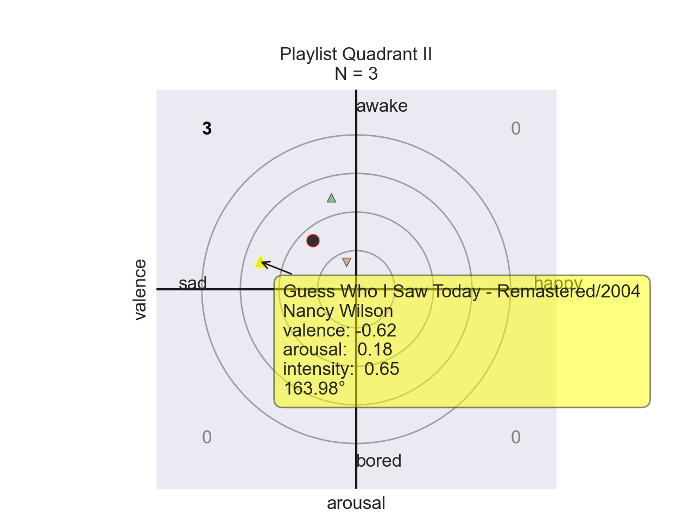
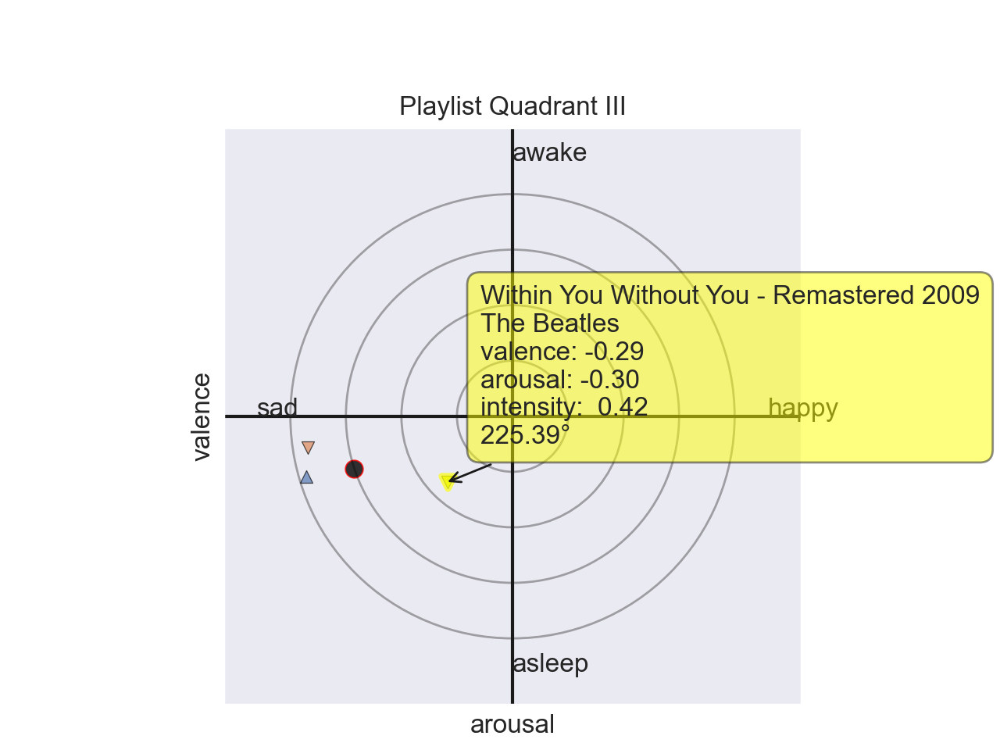
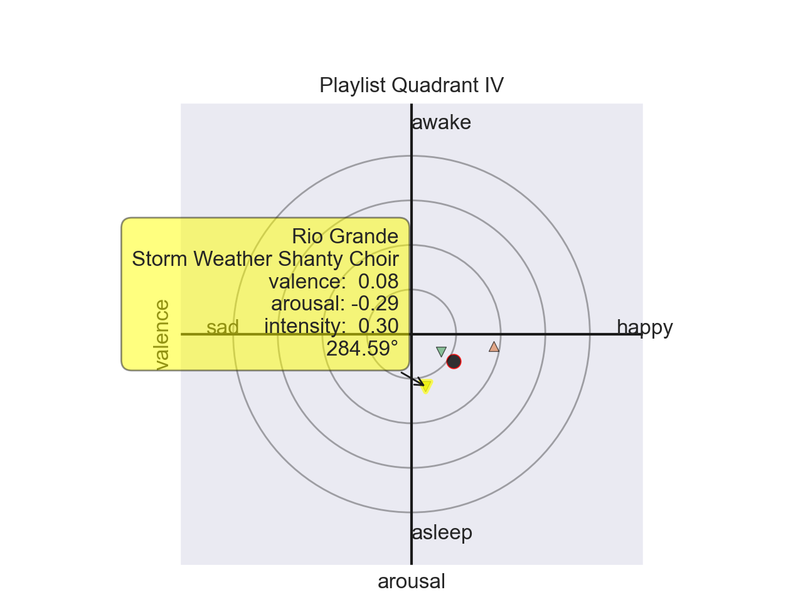
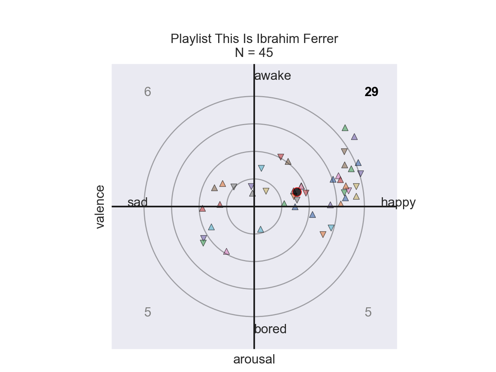
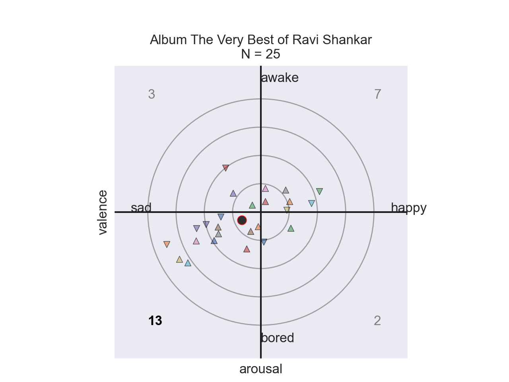
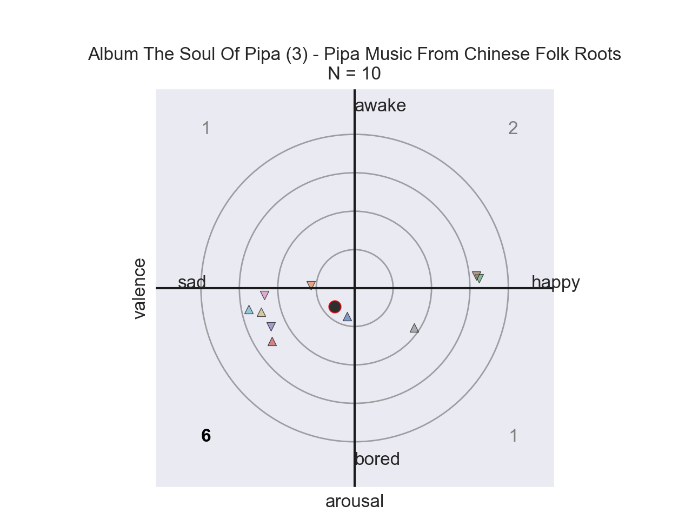
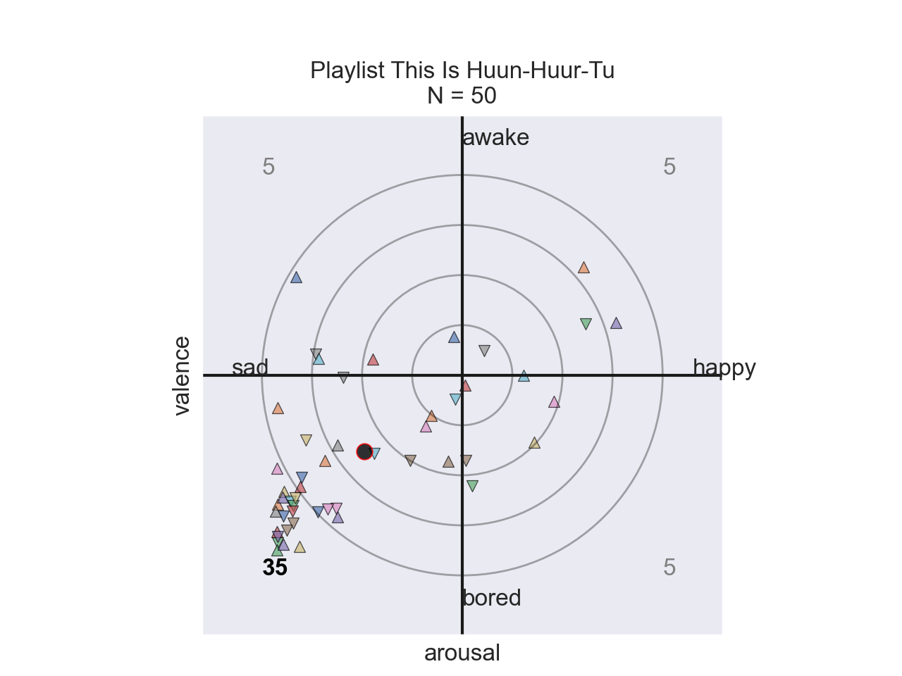
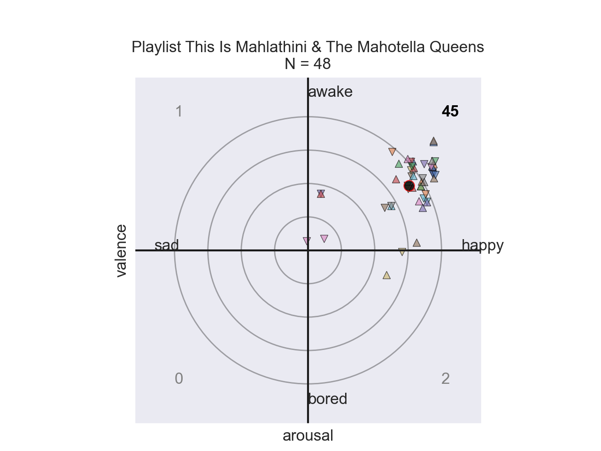
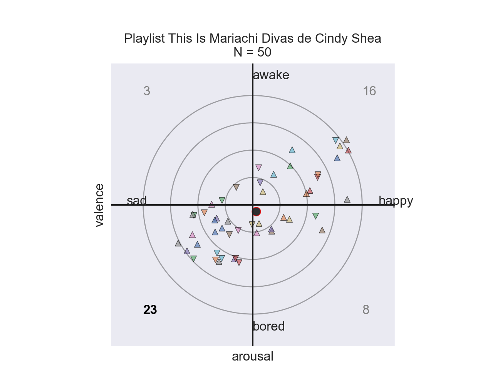
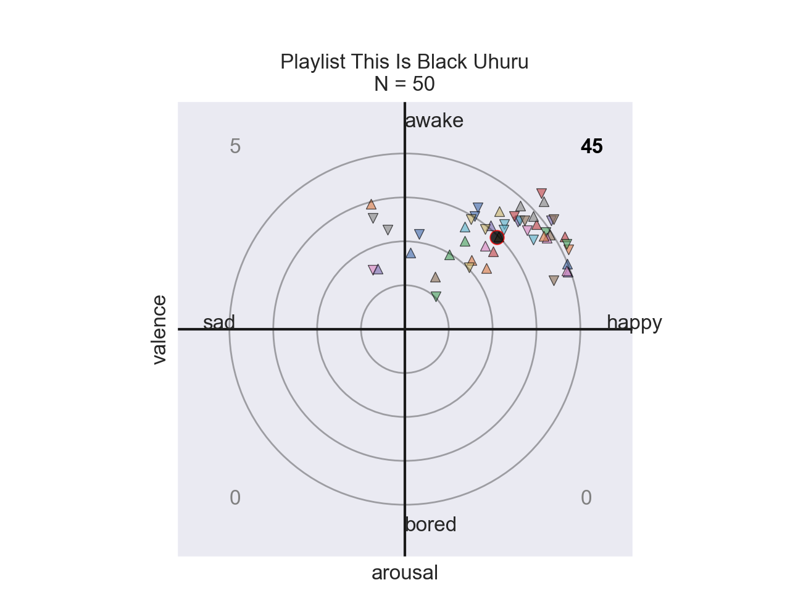

# FKM: *Feels Kuna Man*
A tool for Music Emotion Recognition (MER) using a Python wrapper for Spotify's API.

Independent post-baccalaureate research by Nick Stapleton. For Kunaveer, a friend.

## Abstract
Music emotion recognition (MER) is influenced by an individual's environmental factors. And while there is a wealth of analysis using Western music, it is rare to find literature in machine learning that examines non-Western music. This is problematic because the academic community has not given equal weight to the human experience of peoples from marginalized communities.

The goal of this work is to remedy the imblance of cultures in MER by providing a proof-of-concept framework to enable the analysis of non-Western music. This project contributes *emotives* as a computational abstraction of affetice semantic space, and presents visualization of data from diverse musics of Cuba, India, China, Tuva, South Africa, Mexico, and Jamaica. Future work is called for with actionable data and robust open-source music information retrieval (MIR) framworks to examine the potential of universal affective components of music, with potential applications to psychiatry treatments.

## Motivation
Experiments in MER by psychologists have demonstrated the capability for humans to non-trivially recognize the same emotions across cultural boundaries [1]. Furthermore, additional experiments suggest a universal underlying physiological response that transends sociophyscological conditioning [2]. These findings hint at the possibility that music can be used to invoked similar emotional responses to any listener independent of their cultural background. This potential reality points towards a non-trivial universal framework that can encode affective information through musical data. However, due to the subjectivity of emotion the resolution of the suggested framework can only increase in efficiency by taking an individual's personal preference and cultural background into account.

This project aims to examines to provide a framework to anaylze and visualize affective information of music through Spotify's API.

## Methodology
While 3D models of semantic space have been demonstrated to be effective in music recommendation [4], a 2D valence-arousal model is used for the sake of visaulization. Arousal is estimated by `danceability` in Spotify's API rather than `energy` as explored by [3].

This project contributes a formalized unit for affective computation referred to as *emotives*, see module `helpers.affect.scherer`. An emotive, a unit of emotion [5], is an abstraction for vectors in affective semantic space, and the source code allows for the renaming of emotional labels and the substitution of valence and arousal. Emotions are classified broadly by their quadrants:

* Valence: happy for the first and fourth quadrants, and sad for the second and third quadrants.
* Arousal: awake for the first and second quadrats, and bored for the third and fourth quadrants.

The valence-arousal components of each emotive are provided by Spotify through floating point numbers rangind from $[0, 1]$. For the sake of analysis, these values are linearly transformed about the origin to fall in the range $[-1, 1]$. The position of an emotive is defined in terms of polar coordinates: $(r, \theta)$ where $r$ is the emotive's *intensity*, or vector norm, and $\theta$ is the emotive's *direction*. 

### Music Information Retrieval (Spotify)
Information is provided from Spotify's API through the `helpers.spotify.client` submodule.

* tracks (plotting is not supported)
* albums
* playlists (limited by 100 songs)

### Validation
The data in the following results were carefully selected by the author. Individual songs are represented as triangles, and the center mass of each set of songs is represented by a circle. 

#### Quadrant I ($+$valence, $+$arousal)
The songs in the first quadrant are meant to represent the range of emotions in: happy, awake.

```
PLAYLIST.meta
  name       : Quadrant I
  by         : nicholas.stapleton
  num tracks : 3
  length     : 9m 40s
  url        : https://open.spotify.com/playlist/6Z4hdXA63y3i5L7lE9IuZH
PLAYLIST.tracks
  I've Got a Woman
  by Ray Charles
  on Ray Charles (aka: Hallelujah, I Love Her So)
    valence  :   happy  ( 0.330  )
    arousal  :   awake  ( 0.112  )
    intensity:    0.35
    angle    :   18.75° ( Quad I )
  Como te extraño mi amor
  by Café Tacvba
  on Avalancha de éxitos
    valence  :   happy  ( 0.834  )
    arousal  :   awake  ( 0.582  )
    intensity:    1.02
    angle    :   34.91° ( Quad I )
  Your Love
  by Mick Jenkins
  on Wave[s]
    valence  :   happy  ( 0.278  )
    arousal  :   awake  ( 0.304  )
    intensity:    0.41
    angle    :   47.56° ( Quad I )
PLAYLIST.emotions
  valence  :   happy  ( 0.481  )
  arousal  :   awake  ( 0.333  )
  intensity:    0.58
  angle    :   34.69° ( Quad I )
```

#### Quadrant II ($-$valence, $+$arousal)
The songs in the first quadrant are meant to represent the range of emotions in: sad, awake.

```
PLAYLIST.meta
  name       : Quadrant II
  by         : nicholas.stapleton
  num tracks : 3
  length     : 13m 14s
  url        : https://open.spotify.com/playlist/6gNomfqtRg5LQxBHXiF1hs
PLAYLIST.tracks
  Guess Who I Saw Today - Remastered/2004
  by Nancy Wilson
  on Something Wonderful
    valence  :     sad  ( -0.620 )
    arousal  :   awake  ( 0.178  )
    intensity:    0.65
    angle    :  163.98° (Quad II )
  Blue Rondo à la Turk
  by The Dave Brubeck Quartet
  on Time Out
    valence  :     sad  ( -0.064 )
    arousal  :   awake  ( 0.176  )
    intensity:    0.19
    angle    :  109.98° (Quad II )
  Banana Boat (Day-O)
  by Harry Belafonte
  on Calypso
    valence  :     sad  ( -0.162 )
    arousal  :   awake  ( 0.594  )
    intensity:    0.62
    angle    :  105.26° (Quad II )
PLAYLIST.emotions
  valence  :     sad  ( -0.282 )
  arousal  :   awake  ( 0.316  )
  intensity:    0.42
  angle    :  131.75° (Quad II )
```

#### Quadrant III ($-$valence, $-$arousal)
The songs in the third quadrant are meant to represent the range of emotions in: sad, bored.

```
PLAYLIST.meta
  name       : Quadrant III
  by         : nicholas.stapleton
  num tracks : 3
  length     : 17m 25s
  url        : https://open.spotify.com/playlist/6sHwmWqfay5v2WFbmqOeBL
PLAYLIST.tracks
  Claire de lune
  by Claude Debussy
  on Träumerei - Liebestraum - Für Elise - Clair de lune - Gymnopédie - Sony Classical Masters
    valence  :     sad  ( -0.927 )
    arousal  :   bored  ( -0.270 )
    intensity:    0.97
    angle    :  196.24° (Quad III)
  The Sound of Silence
  by Pat Metheny
  on What's It All About
    valence  :     sad  ( -0.920 )
    arousal  :   bored  ( -0.142 )
    intensity:    0.93
    angle    :  188.77° (Quad III)
  Within You Without You - Remastered 2009
  by The Beatles
  on Sgt. Pepper's Lonely Hearts Club Band (Remastered)
    valence  :     sad  ( -0.292 )
    arousal  :   bored  ( -0.296 )
    intensity:    0.42
    angle    :  225.39° (Quad III)
PLAYLIST.emotions
  valence  :     sad  ( -0.713 )
  arousal  :   bored  ( -0.236 )
  intensity:    0.75
  angle    :  198.31° (Quad III)
```

#### Quadrant IV - ($+$valence, $-$arousal)
The songs in the fourth quadrant are meant to represent the range of emotions in: happy, bored.

```
PLAYLIST.meta
  name       : Quadrant IV
  by         : nicholas.stapleton
  num tracks : 3
  length     : 11m 2s
  url        : https://open.spotify.com/playlist/5iaYVzoF3DDe1YgNwaGLhL
PLAYLIST.tracks
  Rio Grande
  by Storm Weather Shanty Choir
  on Way Hey (And Away We'll Go)
    valence  :     sad  ( 0.076  )
    arousal  :   bored  ( -0.292 )
    intensity:    0.30
    angle    :  284.59° (Quad III)
  Through the Roof 'n' Underground
  by Gogol Bordello
  on Multi Kontra Culti vs Irony
    valence  :     sad  ( 0.460  )
    arousal  :   bored  ( -0.066 )
    intensity:    0.46
    angle    :  351.84° (Quad III)
  Sgt. Pepper's Lonely Hearts Club Band - Remastered 2009
  by The Beatles
  on Sgt. Pepper's Lonely Hearts Club Band (Remastered)
    valence  :     sad  ( 0.166  )
    arousal  :   bored  ( -0.098 )
    intensity:    0.19
    angle    :  329.44° (Quad III)
PLAYLIST.emotions
  valence  :     sad  ( 0.234  )
  arousal  :   bored  ( -0.152 )
  intensity:    0.28
  angle    :  326.99° (Quad III)
```

## Usage
General usage follows:
```
python3 main.py <A SINGLE SPOTIFY URL>
```
Flags can be supplied to the terminal:

* `--print` displays detailed information for each item
* `--plot` provides an interactable figure that displays information for each item 

## Results
This section analyzes the emotions from individual artists in the musics of Cuba, India, China, Tuva, South Africa, Mexico, and Jamaica.
### Ibrahim Ferrer, Cuba (bolero)

```
valence μ:   happy  ( 0.389  )
arousal μ:   awake  ( 0.133  )
intensity:    0.41
angle    :   18.94° ( Quad I )
```

### Ravi Shankar, India (sitar)

```
valence  :     sad  ( -0.168 )
arousal  :   bored  ( -0.072 )
intensity:    0.18
angle    :  203.19° (Quad III)
```

### Liu Feng, China (pipa)

```
valence  :     sad  ( -0.132 )
arousal  :   bored  ( -0.122 )
intensity:    0.18
angle    :  222.79° (Quad III)
```

### Huun-Huur-Tur, Tuva (throat singing)

```
valence μ:     sad  ( -0.489 )
arousal μ:   bored  ( -0.380 )
intensity:    0.62
angle    :  217.89° (Quad III)
```

### Mahlathini, South Africa (mbaqanga)

```
valence μ:   happy  ( 0.755  )
arousal μ:   awake  ( 0.485  )
intensity:    0.90
angle    :   32.72° ( Quad I )
```

### Mariachi Divas de Cindy Shea, Mexico (mariachi)

```
valence μ:   happy  ( 0.033  )
arousal μ:   bored  ( -0.062 )
intensity:    0.07
angle    :  297.67° (Quad IV )
```

### Black Uhuru, Jamaica (reggae)

```
valence μ:   happy  ( 0.523  )
arousal μ:   awake  ( 0.524  )
intensity:    0.74
angle    :   45.10° ( Quad I )
```

## Future Work
This project was intended to quickly gather emotional information of music through Spotify's API. This approach is limited by Spotify's proprietary music information retrieval software (echonest.) While analyis of Thai music was succesful enough to produce a modest classifier [3], an open source solution combined with raw actionable non-Western source music is required for deeper analysis of universal MER. Combined with efforts to identify individual emotive units in songs [5], rather than assigning labels to whole songs, could gather better training data for machine learning models [4]. Applications of MER systems include treatment for psychiatric conditions.

## Citations
```
[1] Fritz, Thomas, et al. “Universal Recognition of Three Basic Emotions in Music.” Current Biology, vol. 19, no. 7, 2009, pp. 573–576, doi:10.1016/j.cub.2009.02.058. 

[2] Egermann, Hauke, et al. “Music Induces Universal Emotion-Related Psychophysiological Responses: Comparing Canadian Listeners To Congolese Pygmies.” Frontiers in Psychology, vol. 5, 2015, doi:10.3389/fpsyg.2014.01341.

[3] Sangnark, Soravitt, et al. “Thai Music Emotion Recognition by Linear Regression.” Proceedings of the 2018 2nd International Conference on Automation, Control and Robots  - ICACR 2018, 2018, doi:10.1088/1742-6596/1195/1/012009.

[4] Deng, James J., et al. “Emotional States Associated with Music.” ACM Transactions on Interactive Intelligent Systems, vol. 5, no. 1, 2015, pp. 1–36., doi:10.1145/2723575. 

[5] Liu, Yang, et al. “Learning Music Emotion Primitives via Supervised Dynamic Clustering.” Proceedings of the 24th ACM International Conference on Multimedia, 2016, doi:10.1145/2964284.2967215. 
```

## Requirements

### Python 3 Modules
* [Spotipy](https://spotipy.readthedocs.io/en/2.18.0/)
* [mplcursors](https://mplcursors.readthedocs.io/en/stable/)
* [seaborn](https://seaborn.pydata.org/installing.html)
* [matplot](https://pypi.org/project/matplotlib/)

### Spotify API Secret Key
A secret key from a Spotify developer's account should be stored in `helpers/spotify/supersecret.py` with the file format:
```python
CLIENT_ID  = 'YOUR KEY'
SECRET_KEY = 'YOUR KEY'
```

