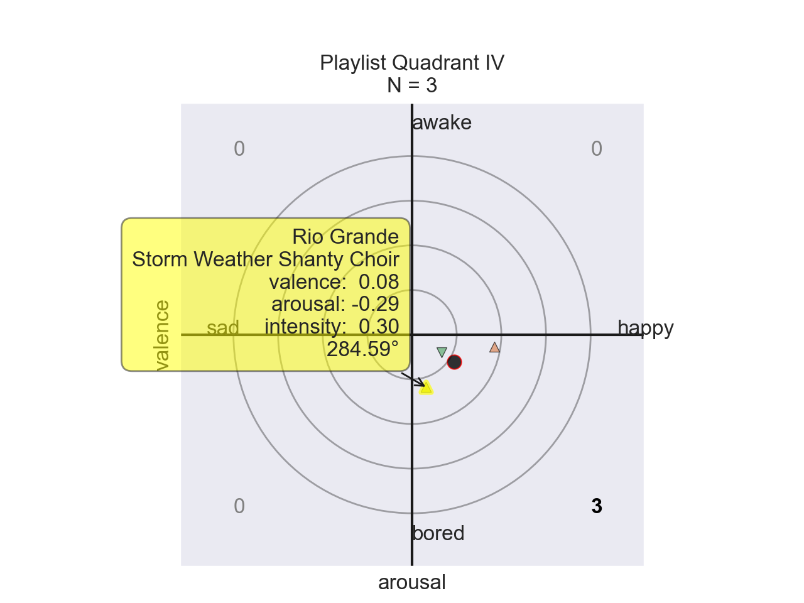

# FKM: *Feels Kuna Man*
Note: this report is a rough draft.

## Abstract
An individual's environment influences factors in music emotion recognition (MER.) And while there is a wealth of analysis using Western music, it is rare to find literature in machine learning that examines non-Western music. This is problematic because the academic community has not given equal weight to the human experience of people from marginalized communities.

The goal of this work is to remedy the imbalance of cultures in MER by providing a proof-of-concept framework to enable the analysis of non-Western music. This project contributes *emotives* as a computational abstraction of affective semantic space, and presents visualization of data from diverse musics of Cuba, India, China, Tuva, South Africa, Mexico, and Jamaica. Future work calls for actionable data and robust open-source music information retrieval (MIR) frameworks to examine the potential of universal affective components of music, with potential applications to psychiatry treatments.

## Motivation
Experiments in MER by psychologists have demonstrated the human ability to non-trivially recognize the same emotions across cultural boundaries [1]. Furthermore, more experiments suggest a universal underlying physiological response that transcends socio-psychological conditioning [2]. These findings hint at the possibility that music can invoke similar emotional responses to any listener independent of their cultural background. This potential reality points towards a non-trivial universal framework that can encode affective information through musical data. However, due to subjective emotions the resolution and efficiency of the suggested framework increases by taking an individual's personal preference and cultural background into account.

This project aims to examines to provide a framework to anaylze and visualize affective information of music through Spotify's API.

## Methodology
While 3D models of semantic space demonstrates effectiveness in music recommendation [4], a 2D valence-arousal model enables visualization. In this work, `danceability` estimates arousal in Spotify's API instead of `energy` as explored by [3].

This project contributes a formalized unit for affective computation referred to as *emotives*, see module [`helpers.affect.scherer`](https://github.com/nhstaple/feelskunaman/blob/88689b7b4df03ad60f7732ac883c7a1b15705cf7/helpers/affect/scherer.py#L57). An emotive, a unit of emotion [5], is an abstraction for vectors in affective semantic space, and the source code allows for the renaming of emotional labels and the substitution of valence and arousal. Quadrants broadly classify emotions in this work:

* Valence: happy for the first and fourth quadrants, and sad for the second and third quadrants.
* Arousal: awake for the first and second quadrats, and bored for the third and fourth quadrants.

The valence-arousal components of each emotive are provided by Spotify through floating point numbers rangind from `[0, 1]`. For the sake of analysis, these values are linearly transformed about the origin to fall in the range `[-1, 1]`. The position of an emotive is defined in terms of polar coordinates: `(r, θ)` where `r` is the emotive's *intensity*, or vector norm, and θ is the emotive's *direction*. 

### Music Information Retrieval (Spotify)
Information is provided from Spotify's API through the [`helpers.spotify.client`](https://github.com/nhstaple/feelskunaman/blob/88689b7b4df03ad60f7732ac883c7a1b15705cf7/helpers/spotify/client.py#L12) submodule.

* tracks (plotting is not supported)
* albums
* playlists (limited by 100 songs)

### Validation
The data in the following section was selected by the author to visualize emotives. Individual songs are represented as triangles, and the mean of each set of songs is represented by a circle. 

#### Quadrant I (`+` valence, `+` arousal)
The songs in the first quadrant are meant to represent the range of emotions betwen happy and awake.

| Title | Artist | Valence | Arousal | Intensity | Angle | 
| :---  | :---   | :---:   | :---:   | :---:     | :---: | 
| I've Got a Woman | Ray Charles | `0.330` | `0.112` | `0.35` | `18.75°` |
| Como te extraño mi amor | Café Tacvba | `0.834` | `0.582` | `1.02` | `34.91°` |
| Your Love | Mick Jenkins | `0.278` | `0.304` | `0.41` | `47.56°` |
| | | | | | | |
| | **mean** | `0.481` | `0.333` | `0.58` | `34.69°` |


#### Quadrant II (`-` valence, `+` arousal)
The songs in the second quadrant are meant to represent the range of emotions between sad and awake.

| Title | Artist | Valence | Arousal | Intensity | Angle | 
| :---  | :---   | :---:   | :---:   | :---:     | :---: |
| Guess Who I Saw Today | Nancy Wilson | `-0.620` | `0.178` | `0.65` | `163.98°` | 
| Blue Rondo à la Turk | The Dave Brubeck Quartet | `-0.064` | `0.176` | `0.19` | `109.98°` |
| Banana Boat (Day-O) | Harry Belafonte | `-0.162` | `0.594` | `0.62` | `105.26°` | 
| | | | | | | |
| | **mean** | `-0.282` | `0.316` | `0.42` | `131.75°` | 


#### Quadrant III (`-` valence, `-` arousal)
The songs in the third quadrant are meant to represent the range of emotions between sad and bored.

| Title | Artist | Valence | Arousal | Intensity | Angle | 
| :---  | :---   | :---:   | :---:   | :---:     | :---: |
| Claire de Lune | Claude Debussy | `-0.927` | `-0.270` | `0.97` | `196.24°` |
| The Sound of Silence | Pat Metheny | `-0.920` | `-0.142` | `0.93` | `188.77°` | 
| Within You Without You | The Beatles | `-0.292` | `-0.296` | `0.42` | `225.39°` | 
| | | | | | | |
| | **mean** | `-0.713` | `-0.236` | `0.75` | `198.31°` | 


#### Quadrant IV (`+` valence, `-` arousal)
The songs in the fourth quadrant are meant to represent the range of emotions between happy and bored.

| Title | Artist | Valence | Arousal | Intensity | Angle | 
| :---  | :---   | :---:   | :---:   | :---:     | :---: | 
| Rio Grande | Storm Weather Shanty Choir | `0.076` | `-0.292` | `0.30` | `284.59°` | 
| Through the Roof 'n' Underground | Gogol Bordello | `0.460` | `-0.066` | `0.46` | `351.84°` |
| Sgt. Pepper's Lonely Hearts Club Band | The Beatles | `0.166` | `-0.098` | `0.19` | `329.44°` | 
| | | | | | | |
| | **mean** | `0.234` | `-0.152` | `0.28` | `326.99°` | 



## Results
This section analyzes the emotions from individual artists in the musics of Cuba, India, China, Tuva, South Africa, Mexico, and Jamaica.
### Ibrahim Ferrer, Cuba (bolero)

```
valence  :   happy  ( 0.389  )
arousal  :   awake  ( 0.133  )
intensity:    0.41
angle    :   18.94° ( Quad I )
```

### Ravi Shankar, India (sitar)

```
valence  :     sad  ( -0.168 )
arousal  :   bored  ( -0.072 )
intensity:    0.18
angle    :  203.19° (Quad III)
```

### Liu Feng, China (pipa)

```
valence  :     sad  ( -0.132 )
arousal  :   bored  ( -0.122 )
intensity:    0.18
angle    :  222.79° (Quad III)
```

### Huun-Huur-Tur, Tuva (throat singing)

```
valence  :     sad  ( -0.489 )
arousal  :   bored  ( -0.380 )
intensity:    0.62
angle    :  217.89° (Quad III)
```

### Mahlathini, South Africa (mbaqanga)

```
valence  :   happy  ( 0.755  )
arousal  :   awake  ( 0.485  )
intensity:    0.90
angle    :   32.72° ( Quad I )
```

### Mariachi Divas de Cindy Shea, California/Mexico (mariachi)

```
valence  :   happy  ( 0.033  )
arousal  :   bored  ( -0.062 )
intensity:    0.07
angle    :  297.67° (Quad IV )
```

### Black Uhuru, Jamaica (reggae)

```
valence  :   happy  ( 0.523  )
arousal  :   awake  ( 0.524  )
intensity:    0.74
angle    :   45.10° ( Quad I )
```

## Future Work
This project aims to quickly gather emotional information of music through Spotify's API. This approach is not general because of Spotify's proprietary music information retrieval software (echonest.) While analysis of Thai music was succesful enough to produce a modest classifier [3], deeper analysis of universal MER necessitates an open source solution combined with raw actionable non-Western source music. Spotify's API limits possible analysis of MER by computing features for an entire song rather than individual sections. While frame data is available, Spotify's API documentation is opaque at the time of investigation making complex analysis infeasible. The author notes *librosa* and *AMUSE* as possible alternative APIs to develop an appropriate framework but would still require actionable non-Western music to extract analyzable information.

Combined with efforts to identify a list of emotive units in songs [5], rather than assigning one label to an entire song, MIR systems could gather better training data for machine learning models [4]. Future work will examine MER similarity of multi-cultural music through psychological features. Potential applications of MER systems include treatment for psychiatric conditions and music education.

## Citations
```
[1] Fritz, Thomas, et al. “Universal Recognition of Three Basic Emotions in Music.” Current Biology, vol. 19, no. 7, 2009, pp. 573–576, doi:10.1016/j.cub.2009.02.058. 

[2] Egermann, Hauke, et al. “Music Induces Universal Emotion-Related Psychophysiological Responses: Comparing Canadian Listeners To Congolese Pygmies.” Frontiers in Psychology, vol. 5, 2015, doi:10.3389/fpsyg.2014.01341.

[3] Sangnark, Soravitt, et al. “Thai Music Emotion Recognition by Linear Regression.” Proceedings of the 2018 2nd International Conference on Automation, Control and Robots  - ICACR 2018, 2018, doi:10.1088/1742-6596/1195/1/012009.

[4] Deng, James J., et al. “Emotional States Associated with Music.” ACM Transactions on Interactive Intelligent Systems, vol. 5, no. 1, 2015, pp. 1–36., doi:10.1145/2723575. 

[5] Liu, Yang, et al. “Learning Music Emotion Primitives via Supervised Dynamic Clustering.” Proceedings of the 24th ACM International Conference on Multimedia, 2016, doi:10.1145/2964284.2967215. 
```

## Requirements

### Python 3 Modules
* [Spotipy](https://spotipy.readthedocs.io/en/2.18.0/)
* [mplcursors](https://mplcursors.readthedocs.io/en/stable/)
* [seaborn](https://seaborn.pydata.org/installing.html)
* [matplot](https://pypi.org/project/matplotlib/)

### Spotify API Secret Key
[Credentials from a Spotify developer account](https://developer.spotify.com/documentation/general/guides/authorization/client-credentials/) should be stored in `helpers/spotify/supersecret.py` with the file format:
```python
CLIENT_ID  = 'YOUR KEY'
SECRET_KEY = 'YOUR KEY'
```

## Usage
General usage in the root project directory follows:
```
python3 main.py <OPTIONAL FLAGS> <ONE SPOTIFY URL>
```

Flags can be supplied to the terminal:

* `--print` displays detailed information for each item
* `--plot` provides an interactable figure that displays information for each item 
* `--normalize` transforms points on the graph to fall along the unit circle (when `--plot` is set)

Note: `--plot` supports interactive figures. Click any point on the graph to display additional information such as song, artist, emotive components, intensity, and angle.

### Examples
**Basic**
```
$ python3 main.py https://open.spotify.com/album/5iIWnMgvSM8uEBwXKsPcXM

Feels Kuna Man - a tool for Music Emotion Recognition

Layla And Other Assorted Love Songs (Remastered 2010)
by Derek & The Dominos
valence  :   happy  ( 0.142  )
arousal  :   bored  ( -0.143 )
intensity:    0.20
angle    :  314.71° (Quad IV )
```

**Printing**
```
$ python3 main.py --print https://open.spotify.com/album/5iIWnMgvSM8uEBwXKsPcXM

Feels Kuna Man - a tool for Music Emotion Recognition

ALBUM.meta
  name       : Layla And Other Assorted Love Songs (Remastered 2010)
  artist     : Derek & The Dominos
  num tracks : 14
  popularity : 69
  length     : 76m 43s
  url        : https://open.spotify.com/album/5iIWnMgvSM8uEBwXKsPcXM
ALBUM.tracks
  I Looked Away
    valence  :   happy  ( 0.458  )
    arousal  :   awake  ( 0.002  )
    intensity:    0.46
    angle    :    0.25° ( Quad I )
  Bell Bottom Blues
    valence  :   happy  ( 0.292  )
    arousal  :   bored  ( -0.192 )
    intensity:    0.35
    angle    :  326.67° (Quad IV )
  Keep On Growing
    valence  :   happy  ( 0.448  )
    arousal  :   awake  ( 0.012  )
    intensity:    0.45
    angle    :    1.53° ( Quad I )
  Nobody Knows You When You're Down And Out
    valence  :     sad  ( -0.248 )
    arousal  :   bored  ( -0.088 )
    intensity:    0.26
    angle    :  199.54° (Quad III)
  I Am Yours
    valence  :   happy  ( 0.224  )
    arousal  :   awake  ( 0.362  )
    intensity:    0.43
    angle    :   58.25° ( Quad I )
  Anyday
    valence  :   happy  ( 0.482  )
    arousal  :   bored  ( -0.618 )
    intensity:    0.78
    angle    :  307.95° (Quad IV )
  Key To The Highway
    valence  :   happy  ( 0.142  )
    arousal  :   bored  ( -0.416 )
    intensity:    0.44
    angle    :  288.85° (Quad IV )
  Tell The Truth
    valence  :   happy  ( 0.178  )
    arousal  :   bored  ( -0.112 )
    intensity:    0.21
    angle    :  327.82° (Quad IV )
  Why Does Love Got To Be So Sad?
    valence  :     sad  ( -0.404 )
    arousal  :   bored  ( -0.244 )
    intensity:    0.47
    angle    :  211.13° (Quad III)
  Have You Ever Loved A Woman?
    valence  :   happy  ( 0.288  )
    arousal  :   bored  ( -0.394 )
    intensity:    0.49
    angle    :  306.17° (Quad IV )
  Little Wing
    valence  :   happy  ( 0.214  )
    arousal  :   bored  ( -0.450 )
    intensity:    0.50
    angle    :  295.43° (Quad IV )
  It's Too Late
    valence  :   happy  ( 0.502  )
    arousal  :   awake  ( 0.062  )
    intensity:    0.51
    angle    :    7.04° ( Quad I )
  Layla
    valence  :     sad  ( -0.006 )
    arousal  :   bored  ( -0.192 )
    intensity:    0.19
    angle    :  268.21° (Quad III)
  Thorn Tree In The Garden
    valence  :     sad  ( -0.584 )
    arousal  :   awake  ( 0.262  )
    intensity:    0.64
    angle    :  155.84° (Quad II )
ALBUM.emotions
  valence  :   happy  ( 0.142  )
  arousal  :   bored  ( -0.143 )
  intensity:    0.20
  angle    :  314.71° (Quad IV )
```

**Plotting**
```
$ python3 main.py --plot https://open.spotify.com/album/5iIWnMgvSM8uEBwXKsPcXM

Feels Kuna Man - a tool for Music Emotion Recognition

Layla And Other Assorted Love Songs (Remastered 2010)
by Derek & The Dominos
valence  :   happy  ( 0.142  )
arousal  :   bored  ( -0.143 )
intensity:    0.20
angle    :  314.71° (Quad IV )
```


**Normalization**
```
$ python3 main.py --plot --normalize https://open.spotify.com/album/5iIWnMgvSM8uEBwXKsPcXM

Feels Kuna Man - a tool for Music Emotion Recognition

Layla And Other Assorted Love Songs (Remastered 2010)
by Derek & The Dominos
valence  :   happy  ( 0.142  )
arousal  :   bored  ( -0.143 )
intensity:    0.20
angle    :  314.71° (Quad IV )
```


