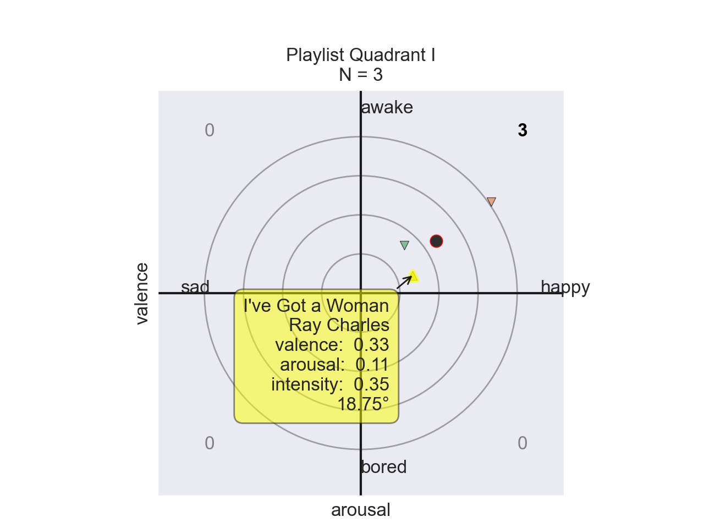
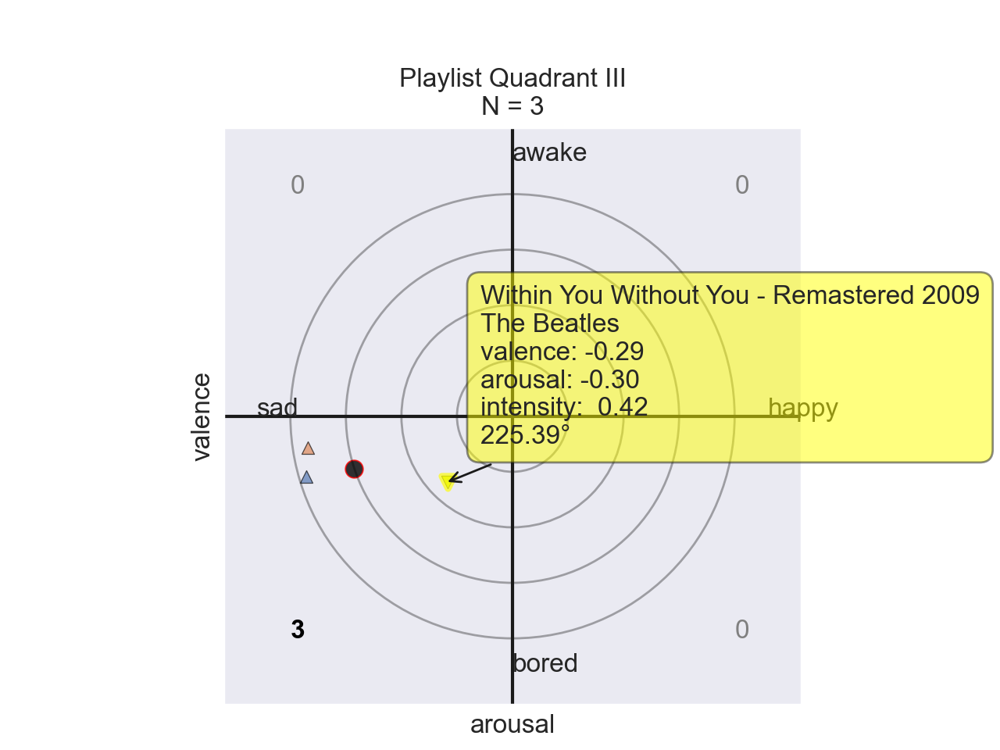

# feelskunaman
For Kunaveer, a friend

## Dependencies

* Python 3
* [SpotiPy](https://spotipy.readthedocs.io/en/2.18.0/)
* [MLPCursors](https://mplcursors.readthedocs.io/en/stable/)
* [Seaborn](https://seaborn.pydata.org/installing.html)
* [Matplot](https://pypi.org/project/matplotlib/)

## About
A tool for Music Emotion Recognition (MER) using a Python wrapper for Spotify's API.

Independent post-baccalaureate research by Nick Stapleton.

## Motivation
MER is conditioned by an individual's environmental factors. However, experiments by music psychologists have demonstrated the capability for humans to non-trivially recognize the same emotions across cultural boundaries [1]. Furthermore, additional experiments suggest a universal underlying physiological response that transends sociophyscological conditioning [2]. These findings hint at the possibility that music can be used to invoked similar emotional responses to any listener independent of their cultural background. This potential reality points towards a non-trivial universal framework that can encode affective information through musical data. However, due to the subjectivity of emotion the resolution of the suggested framework can only increase in efficiency by taking an individual's personal preference and cultural background into account.

Thus, this project aims to examines music via 2-dimensional Scherer space along the dimensions of valence and arousal.

## Methodology
This project examines music via 2-dimensional Scherer space along the dimensions of `valence` and `arousal`, see `helpers.affect.scherer`. These values are transformed from the range `[0, 1`] to `[-1, 1]` through a linear transformation to center about the origin. Results are printed to the terminal through the `--print` command and are visually accessible through the `--plot` command. See [usage](#usage).

`playlists` and `albums` are queried by Spotify's API through the `helpers.spotify.client` submodule. `arousal` is estimated by `danceability` rather than `energy` as explored by [3].

### Spotify API Secret Key
A secret key from a Spotify developer's account should be stored in `helpers/spotify/supersecret.py` with the format:
```
CLIENT_ID  = 'YOUR KEY'
SECRET_KEY = 'YOUR KEY'
```

### Supported Spotify structures

* albums
* playlists (no more than 100 songs in length)

## Usage
This example uses Axis: Bold as Love, by Jimi Hendrix.
```
python3 main.py --print --plot https://open.spotify.com/album/3uFZf8rykoHo7XMIQVYW6r
```


```
ALBUM.meta
  name       : Axis: Bold As Love
  artist     : Jimi Hendrix
  num tracks : 13
  popularity : 67
  length     : 39m 17s
  url        : https://open.spotify.com/album/3uFZf8rykoHo7XMIQVYW6r
ALBUM.tracks
  Exp
    valence  :     sad  ( -0.604 )
    arousal  :   bored  ( -0.182 )
    intensity:    0.63
    angle    :  196.77° (Quad III)
  Up From The Skies
    valence  :     sad  ( -0.174 )
    arousal  :   awake  ( 0.318  )
    intensity:    0.36
    angle    :  118.69° (Quad II )
  Spanish Castle Magic
    valence  :     sad  ( 0.610  )
    arousal  :   bored  ( -0.190 )
    intensity:    0.64
    angle    :  342.70° (Quad III)
  Wait Until Tomorrow
    valence  :   happy  ( 0.648  )
    arousal  :   awake  ( 0.286  )
    intensity:    0.71
    angle    :   23.81° ( Quad I )
  Ain't No Telling
    valence  :     sad  ( 0.178  )
    arousal  :   bored  ( -0.190 )
    intensity:    0.26
    angle    :  313.13° (Quad III)
  Little Wing
    valence  :     sad  ( -0.148 )
    arousal  :   awake  ( 0.030  )
    intensity:    0.15
    angle    :  168.54° (Quad II )
  If 6 Was 9
    valence  :     sad  ( -0.014 )
    arousal  :   bored  ( -0.220 )
    intensity:    0.22
    angle    :  266.36° (Quad III)
  You Got Me Floatin'
    valence  :     sad  ( 0.588  )
    arousal  :   bored  ( -0.046 )
    intensity:    0.59
    angle    :  355.53° (Quad III)
  Castles Made of Sand
    valence  :     sad  ( -0.092 )
    arousal  :   bored  ( -0.078 )
    intensity:    0.12
    angle    :  220.29° (Quad III)
  She's So Fine
    valence  :     sad  ( -0.144 )
    arousal  :   bored  ( -0.246 )
    intensity:    0.29
    angle    :  239.66° (Quad III)
  One Rainy Wish
    valence  :     sad  ( -0.336 )
    arousal  :   bored  ( -0.368 )
    intensity:    0.50
    angle    :  227.60° (Quad III)
  Little Miss Lover
    valence  :   happy  ( 0.810  )
    arousal  :   awake  ( 0.060  )
    intensity:    0.81
    angle    :    4.24° ( Quad I )
  Bold as Love
    valence  :     sad  ( 0.192  )
    arousal  :   bored  ( -0.292 )
    intensity:    0.35
    angle    :  303.33° (Quad III)
ALBUM.emotions
  valence  :     sad  ( 0.116  )
  arousal  :   bored  ( -0.086 )
  intensity:    0.14
  angle    :  323.56° (Quad III)
```

### Validation Results
#### Quadrant I - Happy & Awake

```
PLAYLIST.meta
  name       : Quadrant I
  by         : nicholas.stapleton
  num tracks : 3
  length     : 9m 40s
  url        : https://open.spotify.com/playlist/6Z4hdXA63y3i5L7lE9IuZH
PLAYLIST.tracks
  I've Got a Woman
  by Ray Charles
  on Ray Charles (aka: Hallelujah, I Love Her So)
    valence  :   happy  ( 0.330  )
    arousal  :   awake  ( 0.112  )
    intensity:    0.35
    angle    :   18.75° ( Quad I )
  Como te extraño mi amor
  by Café Tacvba
  on Avalancha de éxitos
    valence  :   happy  ( 0.834  )
    arousal  :   awake  ( 0.582  )
    intensity:    1.02
    angle    :   34.91° ( Quad I )
  Your Love
  by Mick Jenkins
  on Wave[s]
    valence  :   happy  ( 0.278  )
    arousal  :   awake  ( 0.304  )
    intensity:    0.41
    angle    :   47.56° ( Quad I )
PLAYLIST.emotions
  valence  :   happy  ( 0.481  )
  arousal  :   awake  ( 0.333  )
  intensity:    0.58
  angle    :   34.69° ( Quad I )
```

#### Quadrant II - Sad & Awake

```
PLAYLIST.meta
  name       : Quadrant II
  by         : nicholas.stapleton
  num tracks : 3
  length     : 13m 14s
  url        : https://open.spotify.com/playlist/6gNomfqtRg5LQxBHXiF1hs
PLAYLIST.tracks
  Guess Who I Saw Today - Remastered/2004
  by Nancy Wilson
  on Something Wonderful
    valence  :     sad  ( -0.620 )
    arousal  :   awake  ( 0.178  )
    intensity:    0.65
    angle    :  163.98° (Quad II )
  Blue Rondo à la Turk
  by The Dave Brubeck Quartet
  on Time Out
    valence  :     sad  ( -0.064 )
    arousal  :   awake  ( 0.176  )
    intensity:    0.19
    angle    :  109.98° (Quad II )
  Banana Boat (Day-O)
  by Harry Belafonte
  on Calypso
    valence  :     sad  ( -0.162 )
    arousal  :   awake  ( 0.594  )
    intensity:    0.62
    angle    :  105.26° (Quad II )
PLAYLIST.emotions
  valence  :     sad  ( -0.282 )
  arousal  :   awake  ( 0.316  )
  intensity:    0.42
  angle    :  131.75° (Quad II )
```

#### Quadrant III - Sad & Bored

```
PLAYLIST.meta
  name       : Quadrant III
  by         : nicholas.stapleton
  num tracks : 3
  length     : 17m 25s
  url        : https://open.spotify.com/playlist/6sHwmWqfay5v2WFbmqOeBL
PLAYLIST.tracks
  Claire de lune
  by Claude Debussy
  on Träumerei - Liebestraum - Für Elise - Clair de lune - Gymnopédie - Sony Classical Masters
    valence  :     sad  ( -0.927 )
    arousal  :   bored  ( -0.270 )
    intensity:    0.97
    angle    :  196.24° (Quad III)
  The Sound of Silence
  by Pat Metheny
  on What's It All About
    valence  :     sad  ( -0.920 )
    arousal  :   bored  ( -0.142 )
    intensity:    0.93
    angle    :  188.77° (Quad III)
  Within You Without You - Remastered 2009
  by The Beatles
  on Sgt. Pepper's Lonely Hearts Club Band (Remastered)
    valence  :     sad  ( -0.292 )
    arousal  :   bored  ( -0.296 )
    intensity:    0.42
    angle    :  225.39° (Quad III)
PLAYLIST.emotions
  valence  :     sad  ( -0.713 )
  arousal  :   bored  ( -0.236 )
  intensity:    0.75
  angle    :  198.31° (Quad III)
```

#### Quadrant IV - Happy & Bored

```
PLAYLIST.meta
  name       : Quadrant IV
  by         : nicholas.stapleton
  num tracks : 3
  length     : 11m 2s
  url        : https://open.spotify.com/playlist/5iaYVzoF3DDe1YgNwaGLhL
PLAYLIST.tracks
  Rio Grande
  by Storm Weather Shanty Choir
  on Way Hey (And Away We'll Go)
    valence  :     sad  ( 0.076  )
    arousal  :   bored  ( -0.292 )
    intensity:    0.30
    angle    :  284.59° (Quad III)
  Through the Roof 'n' Underground
  by Gogol Bordello
  on Multi Kontra Culti vs Irony
    valence  :     sad  ( 0.460  )
    arousal  :   bored  ( -0.066 )
    intensity:    0.46
    angle    :  351.84° (Quad III)
  Sgt. Pepper's Lonely Hearts Club Band - Remastered 2009
  by The Beatles
  on Sgt. Pepper's Lonely Hearts Club Band (Remastered)
    valence  :     sad  ( 0.166  )
    arousal  :   bored  ( -0.098 )
    intensity:    0.19
    angle    :  329.44° (Quad III)
PLAYLIST.emotions
  valence  :     sad  ( 0.234  )
  arousal  :   bored  ( -0.152 )
  intensity:    0.28
  angle    :  326.99° (Quad III)
```

## Future Work
This project was intended to be used to quickly gather emotional information of music through Spotify's API. This approach is limited by Spotify's internal music information retrieval software (echonest) and lacks full transparency. While analyis of Thai music was succesful enough to produce a modest classifier [3], an open source solution combined with raw actionable non-Western source music, is required for deeper analysis of universal MER.

## Citations
```
[1] Fritz, Thomas, et al. “Universal Recognition of Three Basic Emotions in Music.” Current Biology, vol. 19, no. 7, 2009, pp. 573–576, doi:10.1016/j.cub.2009.02.058. 

[2] Egermann, Hauke, et al. “Music Induces Universal Emotion-Related Psychophysiological Responses: Comparing Canadian Listeners To Congolese Pygmies.” Frontiers in Psychology, vol. 5, 2015, doi:10.3389/fpsyg.2014.01341.

[3] Sangnark, Soravitt, et al. “Thai Music Emotion Recognition by Linear Regression.” Proceedings of the 2018 2nd International Conference on Automation, Control and Robots  - ICACR 2018, 2018, doi:10.1088/1742-6596/1195/1/012009 
```